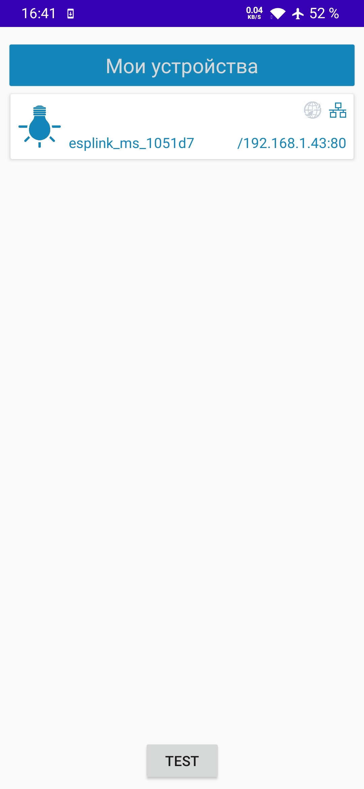
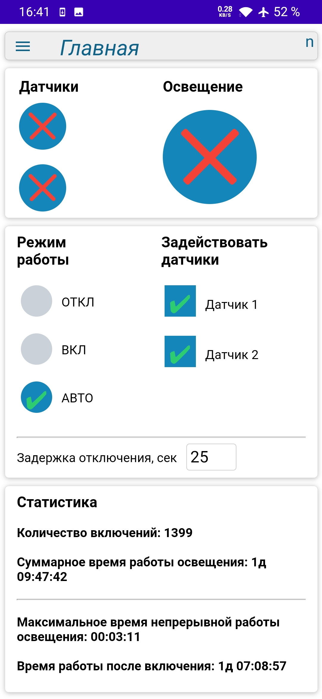
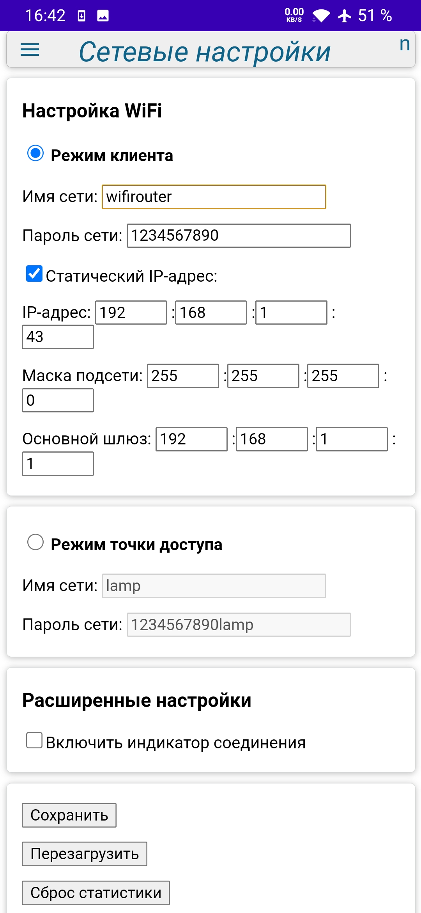
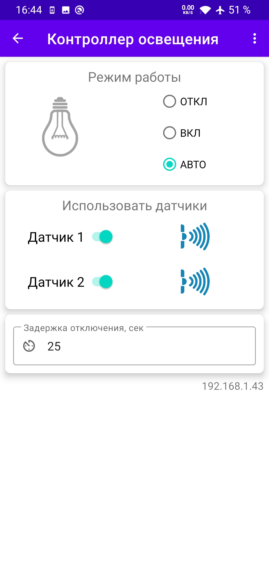
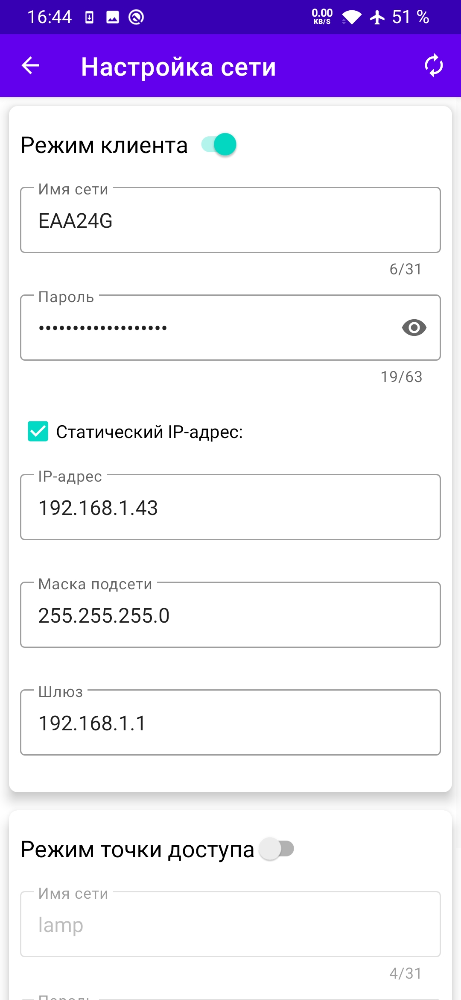
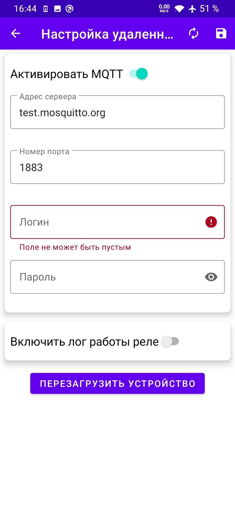

## ESP8266-motion-sensor
### Контроллер управления реле от двух PIR датчиков движения.
------------
#### Функционал контроллера:
- Автоматический режим работы:
   - автоматическое включение реле при срабатывании одного из датчиков движения;
   - автоматическое отключение реле по истечении заданного времени при отсутствии движения.
- Режим ручного управления, через вебинтерфейс.
- Управление через вебинтерфейс управления реле позволяет:
   - выбирать режим работы автоматический или ручной,
   - включать/отключать реле,
   - задействовать один любой из датчиков движения или оба одновременно,
   - изменять время выдержки до автоматического отключения реле.
- Ведение и сохранение статистики работы реле:
   - суммарное количество включений реле,
   - суммарное время работы реле в состоянии включено,
   - продолжительность непрерывной работы контроллера, с момента подачи на него напряжения,
   - максимальное время непрерывной работы реле в состоянии включено, с момента подачи на него напряжения.
   - Логирование в файл времени включения реле с фиксацией времени и номера датчика движения по которому произошло срабатывание.

#### Управление и настройка контроллера:
Управление кортроллером может выполняться через веб-интерфейс из любого браузера.

- контроллер может работать в режиме WIFI-точки доступа;
- контроллер может работать в режиме WIFI-клиента для подключения к роутеру;
- автозапуск в режиме WIFI-точки доступа "По умолчанию" с настройками по умолчанию (для первичной настройки устройства);

Страницы для управление через веб-интерфейс:
- Страница управления и настройки реле (/index.htm);
- Страница сетевых настроек (/setup.htm);
- Страница файлового менеджера для просмотра, удаления и загрузки файлов (/edit.htm);
- Страница обновления прошивки контроллера (/update.htm);

|  |  |  |  |
|:---------:|:---------:|:---------:|:---------:|

Так же кортроллером можно управлять через приложение Android.
|  |  |  |  |
|:---------:|:---------:|:---------:|:---------:|

#### Используемые технологии:
- Web сервер (порт: 80) на устройстве для подключения к устройству по сети из любого web-браузера;
- Websocket сервер (порт: 81) на устройстве для обмена коммандами и данными между страницей в web-браузере и контроллером;
- mDNS-сервис на устройстве для автоматического определения IP-адреса устройства в сети;
- NTP-клиент для синхронизации времени с сервером времени через интернет;
- MQTT-клиент для удаленного облачного управления с помощью приложения Android;

#### Подключение PIR-датчиков движения и реле:
- GPIO14 (D5) - Датчик №1
- GPIO5 (D1)  - Датчик №2
- GPIO16 (D0) - Управление реле

#### Подключение других элементов (для платы типа ESP8266 Witty):
- GPIO2 (D4) - голубой wifi светодиод;
- GPIO4 (D2) - кнопка, подключена к пину (для платы типа ESP8266 Witty);
- GPIO12 (D6) - зеленый цвет RGB-светодиода (для платы типа ESP8266 Witty);
- GPIO13 (D7) - синий цвет RGB-светодиода (для платы типа ESP8266 Witty);
- GPIO15 (D8) - красный цвет RGB-светодиода (для платы типа ESP8266 Witty).
